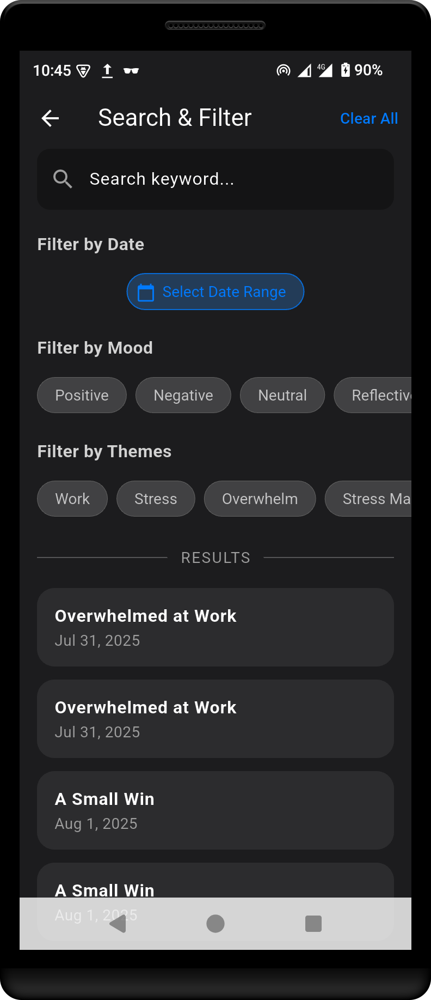

#  MindMeld AI 🧠✨

MindMeld AI is a modern, intelligent, and private journaling application built with Flutter. It's designed to be a personal companion for self-reflection and growth, leveraging the power of Generative AI to provide users with deeper insights into their own thoughts and feelings.

This project is the result of a step-by-step development process, showcasing the creation of a feature-rich mobile application with a focus on professional architecture, clean code, and a beautiful, adaptive user interface.

## Table of Contents
- [App Showcase](#app-showcase)
- [Core Features](#core-features)
- [Technology Stack](#technology-stack)
- [Architecture & Professional Patterns](#architecture--professional-patterns)
- [Getting Started](#getting-started)
- [Future Roadmap](#future-roadmap)
- [License](#license)

---

## App Showcase

<table width="100%">
  <tr>
    <td width="25%" align="center"><strong>Home Screen</strong></td>
    <td width="25%" align="center"><strong>Entry Detail</strong></td>
    <td width="25%" align="center"><strong>Adaptive Layout (Landscape)</strong></td>
    <td width="25%" align="center"><strong>Dashboard</strong></td>
  </tr>
  <tr>
    <td width="25%"></td>
    <td width="25%"></td>
    <td width="25%"></td>
    <td width="25%"></td>
  </tr>
  <tr>
    <td width="25%" align="center"><strong>Search & Filter</strong></td>
    <td width="25%" align="center"><strong>Settings & Personalization</strong></td>
    <td width="25%" align="center"><strong>Entry Creation</strong></td>
    <td width="25%" align="center"><strong>Authentication</strong></td>
  </tr>
  <tr>
    <td width="25%"></td>
    <td width="25%"></td>
    <td width="25%"></td>
    <td width="25%"></td>
  </tr>
</table>

## Core Features

- **📝 Rich Journaling:** Create entries with titles, multi-line text, and multiple photos.
- **🧠 AI-Powered Analysis:** Each entry is automatically analyzed by Google's Gemini AI to provide:
    - **Sentiment:** Positive, Negative, Neutral, or Reflective mood analysis.
    - **Key Themes:** Identification of core topics like "Work," "Personal Growth," etc.
    - **Summaries & Advice:** Concise summaries and compassionate, actionable advice.
- **📊 Interactive Dashboard:** Visualize your mood over time with a beautiful, filterable chart and see key statistics about your journaling habits.
- **🔒 Privacy First:**
    - All data is stored locally and securely on your device using **Hive**.
    - **Biometric App Lock** (Fingerprint/Face ID) protects your journal from unauthorized access.
    - **Lifecycle-Aware Lock:** The app automatically re-locks after being in the background for a set duration.
- **🎨 Personalization:**
    - Create a user profile with a custom name and profile picture.
    - Choose from multiple **app accent colors** to make the app your own.
- **✨ Adaptive & Modern UI:**
    - A stunning, dark-mode UI inspired by professional designs.
    - **Adaptive Layout:** The interface intelligently switches from a bottom navigation bar to a side navigation rail on tablets or in landscape mode.
- **🔎 Powerful Search:** A dedicated screen to search and filter all entries by keyword, date range, mood, and AI-generated themes.
- **🚀 Smooth Onboarding:** A polished, multi-step onboarding flow for first-time users.

## Technology Stack

| Component          | Technology / Package                                          |
|--------------------|---------------------------------------------------------------|
| **Framework**      | `Flutter 3.x.x`                                               |
| **State Management** | `provider` for global state (like theming)                 |
| **Local Database** | `hive` / `hive_flutter` for fast, on-device NoSQL storage      |
| **Generative AI**  | `google_generative_ai` (for Google Gemini API)            |
| **UI & Charting**  | `table_calendar`, `fl_chart`, `image_picker`                    |
| **Security**       | `local_auth` for biometrics, `shared_preferences` for flags    |

## Architecture & Professional Patterns

This project wasn't just built; it was architected. Key professional patterns include:

- **Service-Oriented Architecture:** Logic for AI, security, and theming is decoupled into dedicated "services," keeping UI code clean and maintainable.
- **Adaptive UI:** `LayoutBuilder` is used to create a responsive experience for various screen sizes and orientations.
- **Global State Management:** `Provider` is used for app-wide state (like the current theme), ensuring the UI reacts instantly to changes.
- **Asynchronous Operations:** All database and network calls are handled asynchronously using `Future` and `async/await` to ensure a smooth, non-blocking UI.
- **Clean Code Practices:** Helper methods are used extensively to break down complex UI into readable components. All sensitive keys are stored in a `.gitignore`'d `secrets.dart` file.

## Getting Started

To get a local copy up and running, follow these simple steps.

### Prerequisites

- You must have the [Flutter SDK](https://docs.flutter.dev/get-started/install) installed on your machine.
- An IDE like Visual Studio Code or Android Studio.

### Installation

1. Clone the repo
   ```sh
   git clone https://github.com/your-username/mindmeld_ai.git


Navigate into the project directory

Generated sh
cd mindmeld_ai
Sh

Install dependencies

Generated sh
flutter pub get

Crucial: Create your AI API key file.

In the lib/ directory, create a new file named secrets.dart.

Add the following content, pasting in your API key from Google AI Studio:

const String geminiApiKey = 'PASTE_YOUR_GEMINI_API_KEY_HERE';

Run the code generator for the Hive database models:

Generated sh
flutter pub run build_runner build --delete-conflicting-outputs

Sh
IGNORE_WHEN_COPYING_END

Run the app on an emulator or a physical device:

Generated sh
flutter run

Future Roadmap

This project has a strong foundation, but there are many exciting paths forward:

Habit & Goal Tracking: Integrate tools to set and track personal goals.

Secure Cloud Sync: Implement end-to-end encrypted backup and sync using Firebase.

AI-Powered Notifications: Proactively send users a weekly summary of their mood trends.

Rich Text Editing: Add markdown support (bold, italics, lists) to the journal editor.

License

Distributed under the MIT License. See LICENSE.txt for more information.

This project was created with the guidance and collaboration of a generative AI assistant, demonstrating a modern workflow for rapid, iterative, and feature-rich application development.

